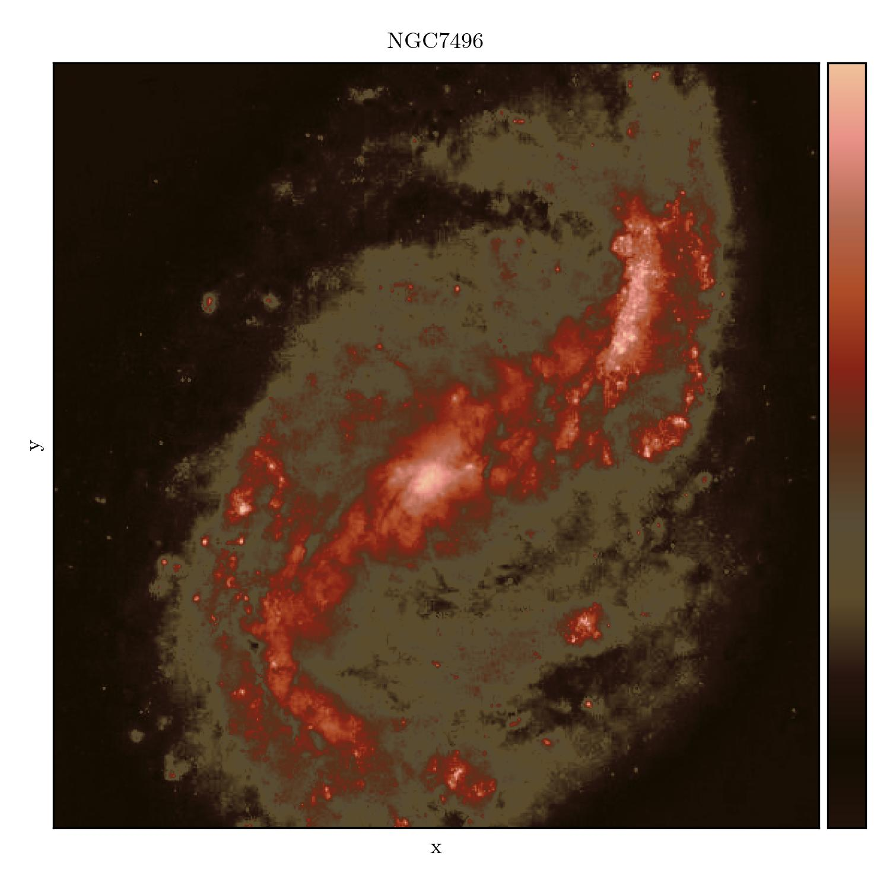
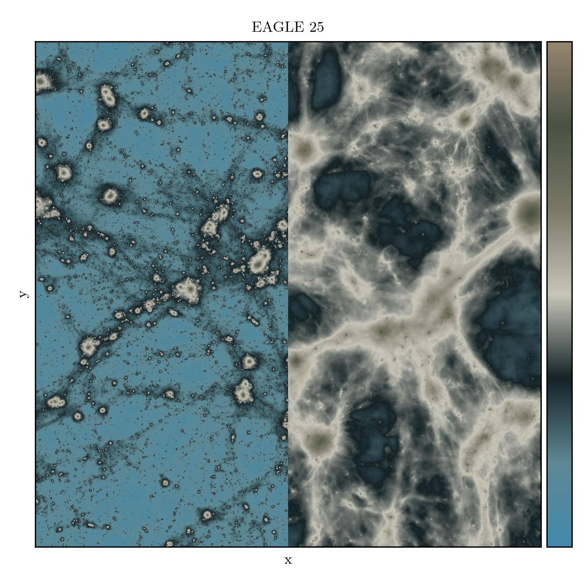
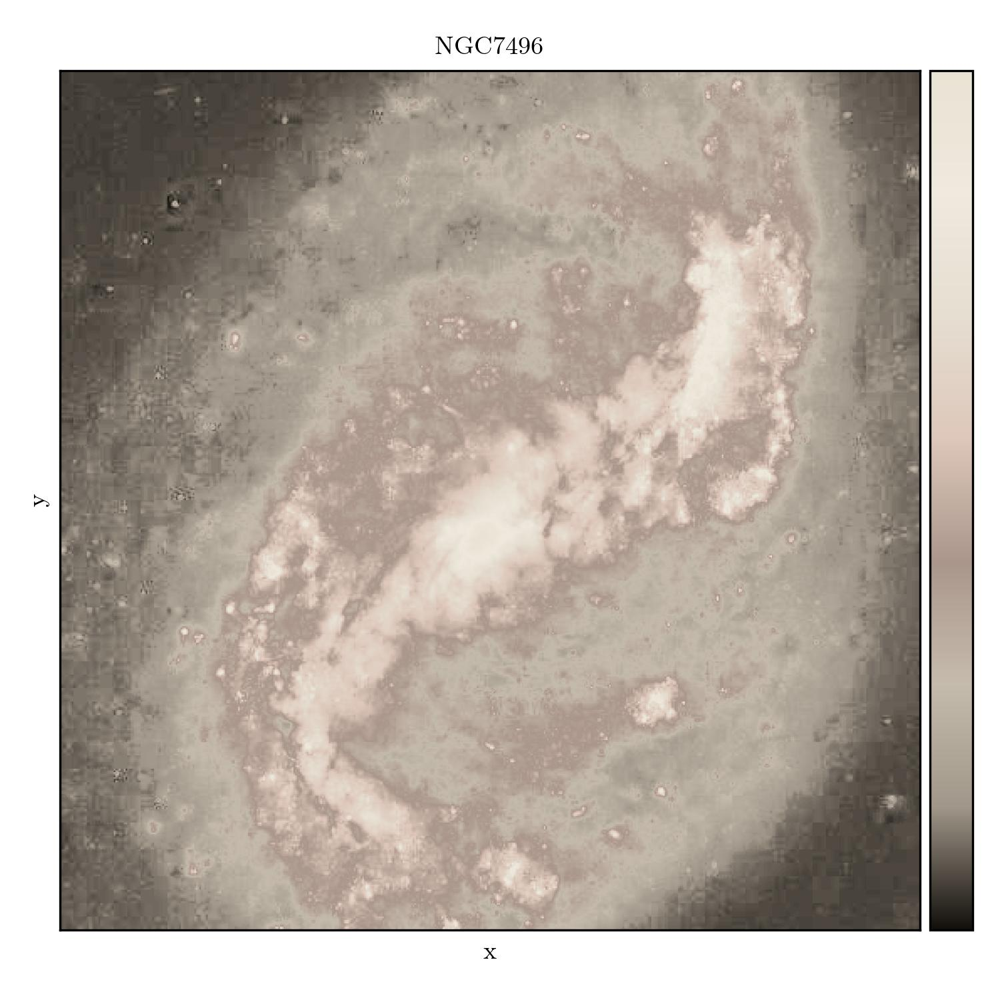
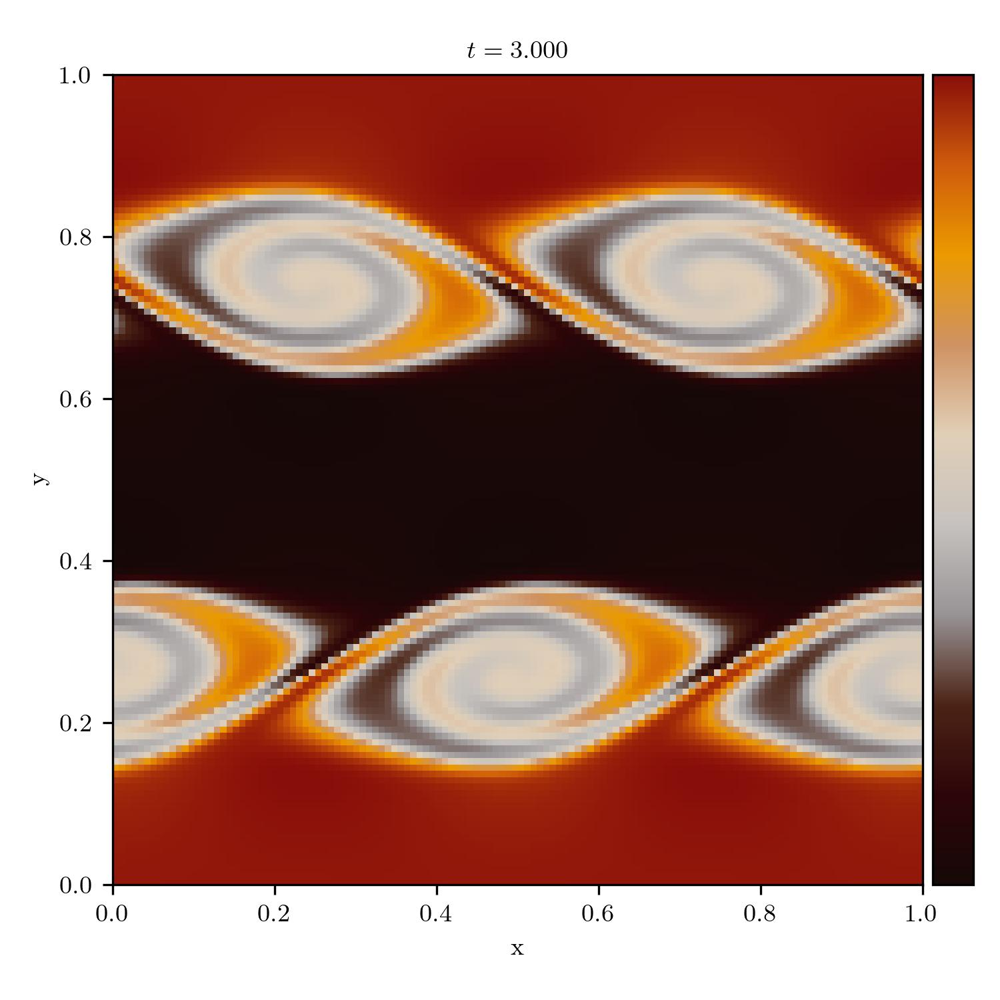
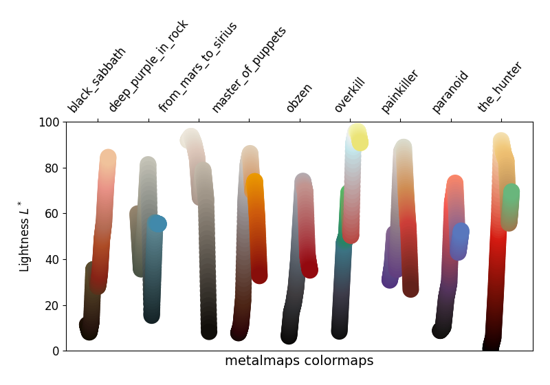

## Metalmaps - Heavy Metal and Classic Rock Album Art Inspired Matplotlib Colormaps

Ever wanted to make your python plots more metal? Fear not, now you can! `metalmaps`
delivers heavy metal and classic rock album art inspired `matplotlib` colormaps!

All of this was inspired by (and shamelessly copied from) Josh Borrow's 
[swiftascmaps](https://github.com/jborrow/swiftascmaps).

License: LGPLv3

Authors: Mladen Ivkovic, Josh Borrow


Installation
------------------

Install this package via pip:

```bash
pip install metalmaps
```

Alternatively, grab the source from [github](https://github.com/mladenivkovic/metalmaps).


Usage
-----

To use these, you can import them and use them
with matplotlib as you would with any other color map.

```python
from metalmaps import black_sabbath
from matplotlib.pyplot import imshow
from numpy import random

imshow(random.rand(128, 128), cmap=black_sabbath)
```

The color maps can also be accessed in matplotlib using strings
by prefixing `metalmaps`, e.g.

```python
import metalmaps

imshow(random.rand(128, 128), cmap="metalmaps.red")
```


Examples
--------

This package currently includes over 20 examples, and counting: 

+   The Apostasy (Behemoth)
+   Black Sabbath (Black Sabbath)
+   The Blues Brothers (The Blues Brothers)
+   Blues Pills (Blues Pills)
+   Cosmo's Factory (Creedence Clearwater Revival)
+   Deep Purple in Rock (Deep Purple)
+   The Dethalbum (Dethklok)
+   From Mars to Sirius (Gojira)
+   L.A. Woman (The Doors)
+   London Calling (The Clash)
+   Master of Puppets (Metallica)
+   Made in Japan (Deep Purple)
+   Meteora (Linkin Park)
+   obZen (Meshuggah)
+   Paranoid (Black Sabbath)
+   Ride the Lightning (Metallica)
+   The Rise and Fall of Ziggy Stardust and the Spiders From Mars (David Bowie)

| :exclamation:  **For a full gallery, visit https://mladenivkovic.github.io/metalmaps/metalmaps.html ** |
|--------------------------------------------------------------------------------------------------------|

Here are some examples:


### Black Sabbath (_Black Sabbath_)



### Deep Purple in Rock (_Deep Purple_)



### From Mars To Sirius (_Gojira_)



### Master of Puppets (_Metallica_)



### obZen (_Meshuggah_)


### Paranoid (_Black Sabbath_)


Note
----

Of course, these aren't necessarily designed to be colorblind
friendly, or perceptually uniform, so use them with caution.
They are fun though. To underline how much you should
_not_ use these in a real scientific publication (apart from
perhaps qualitative imaging), the lightness values are shown
below.



For quantitative comparisons, please ensure that you use a
perceptually uniform colour map (see e.g. those available
directly through [matplotlib](https://matplotlib.org/3.1.0/tutorials/colors/colormaps.html)).


Contributing
------------

Yes please! It would be grand to collect even more album art colormaps.

Intstructions:

+ generate your color palette any way you please, and add it to `colors.py`
+ instantiate the matplotlib colormap in `__init__.py`
+ submit your merge request
+ ???
+ profit!


Image Credits
-------------

+ The "Kelvin-Helmholtz" data used in the plots below were generated using [mesh-hydro](https://github.com/mladenivkovic/mesh-hydro).
+ The "EAGLE" data used in the plots below were obtained from the [swiftsim](https://github.com/SWIFTSIM/SWIFT) repository.
+ The "NGC" data used in the plots below were originally obtained from [flickr](https://www.flickr.com/photos/geckzilla/52040747525/), credits to [Judy Schmidt](https://www.flickr.com/people/geckzilla/). I modified the image later to normalize the pixel values to be able to demonstrate the colormaps as below.
