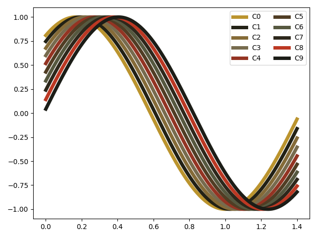
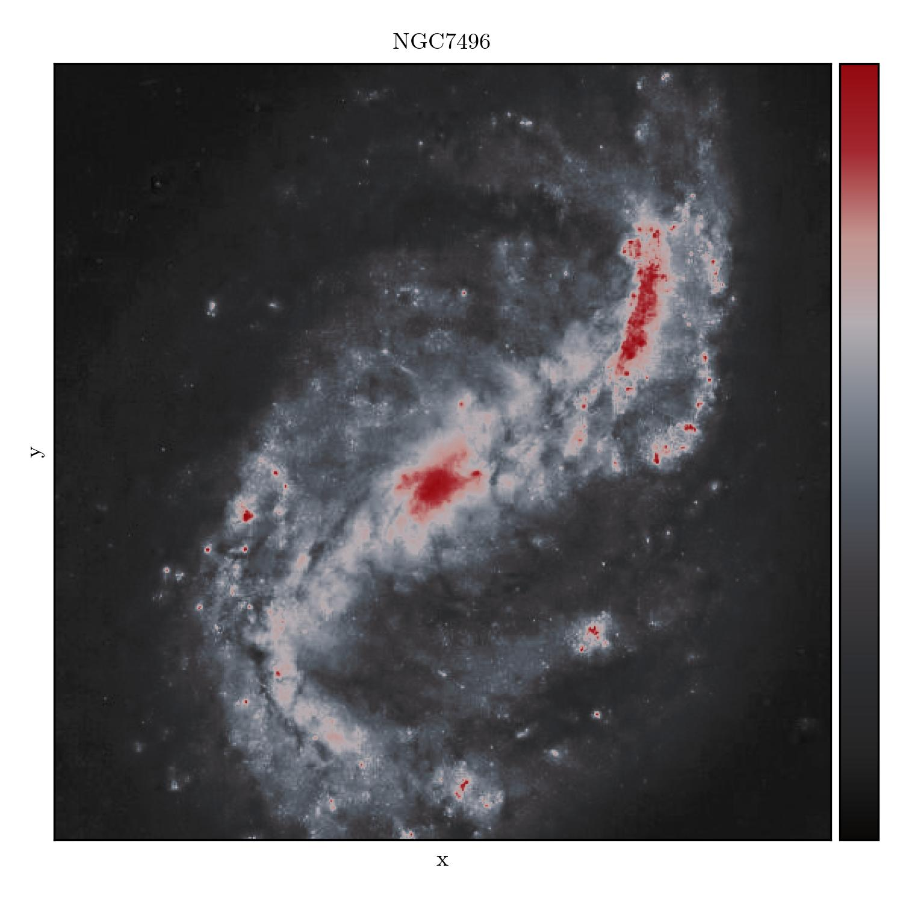
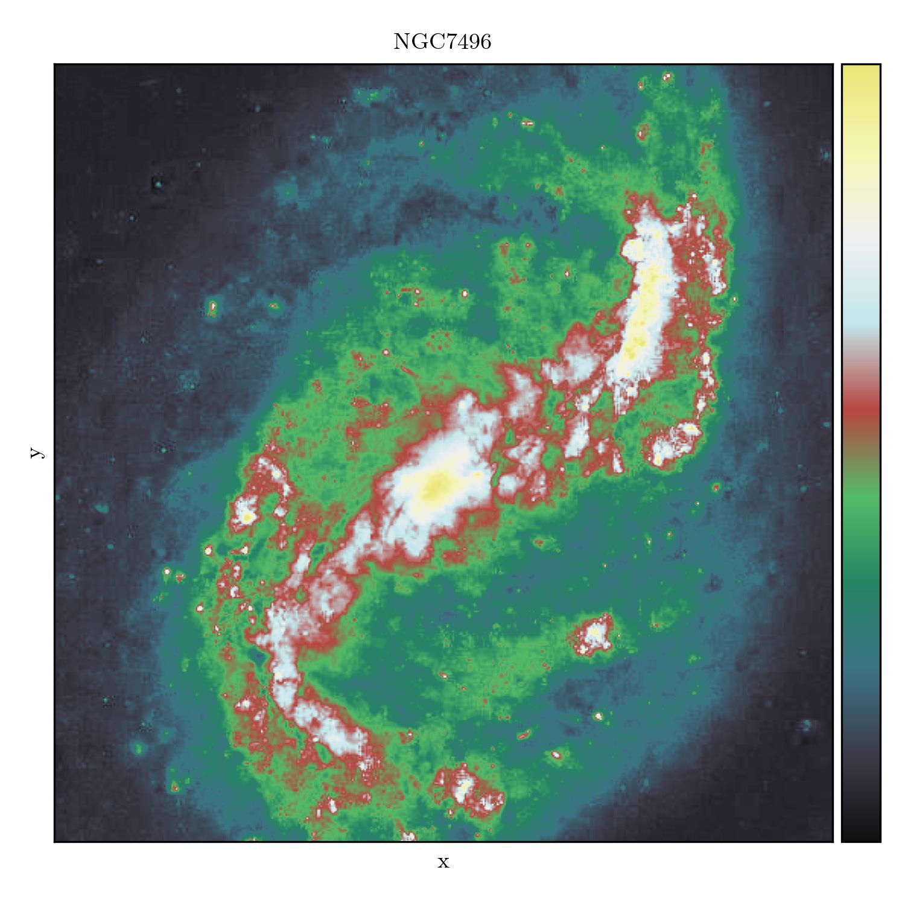
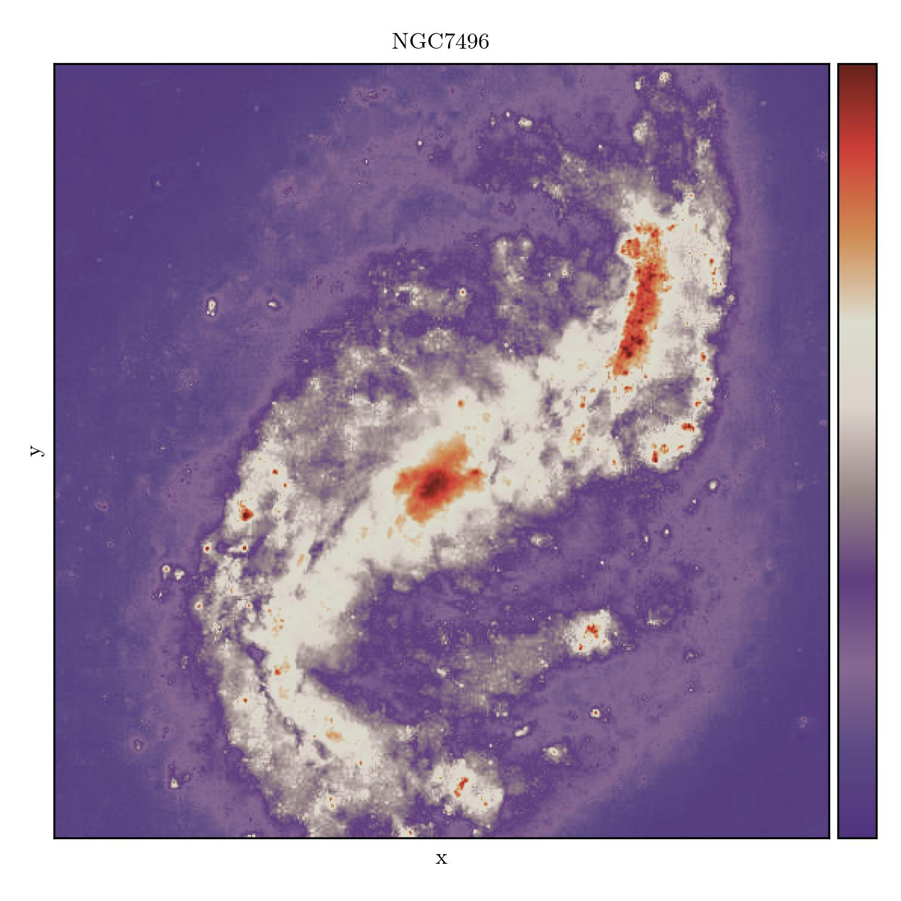
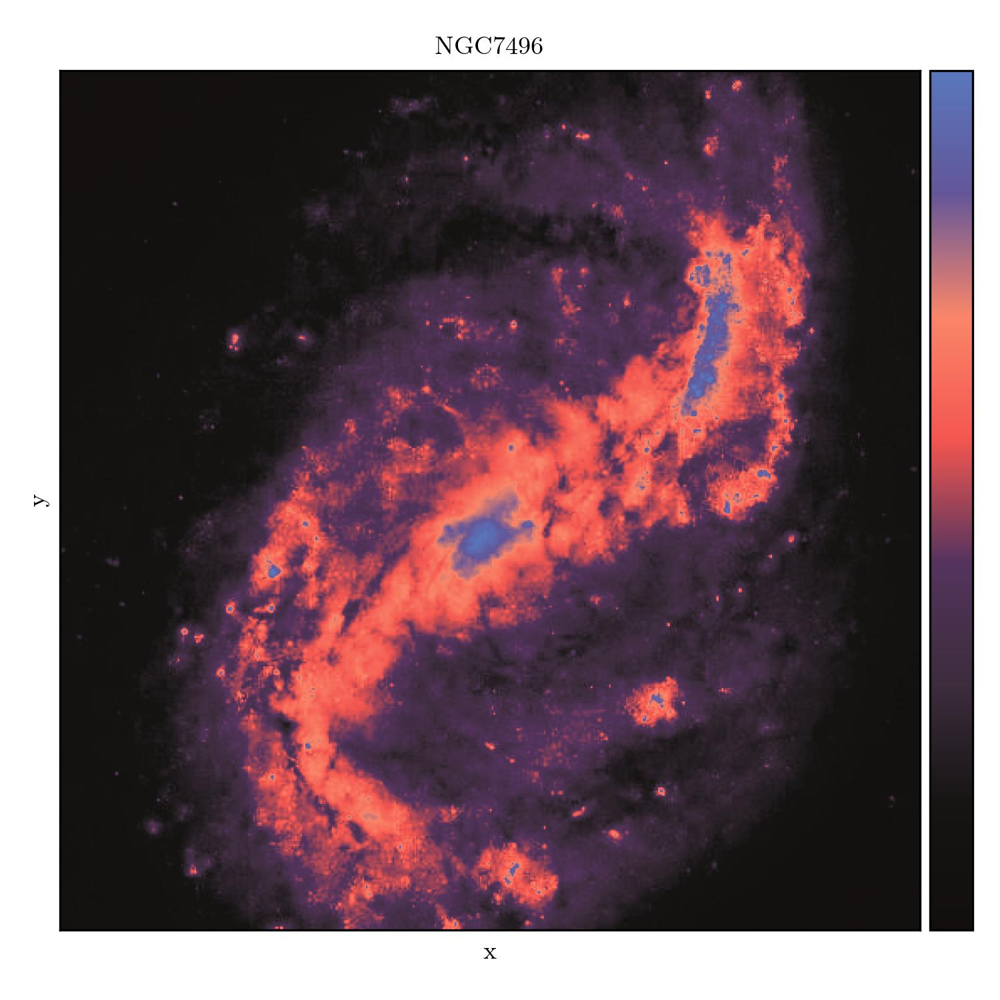
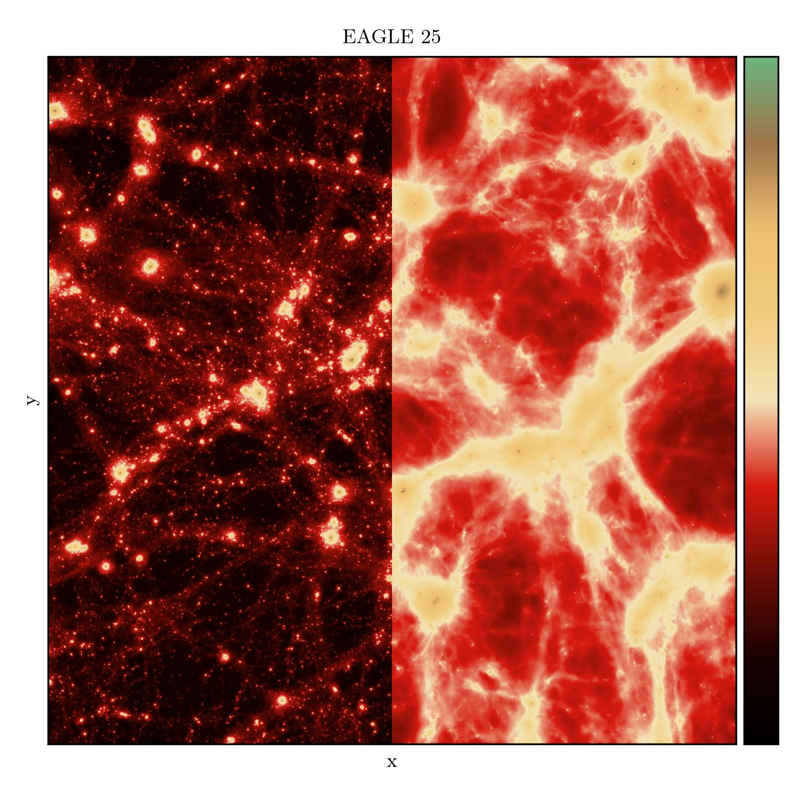

Metalmaps - Heavy Metal and Classic Rock Album Art Inspired Matplotlib Colormaps
----------------------------------------------------------------------------------

Ever wanted to make your python plots more metal? Fear not, now you can! `metalmaps`
delivers heavy metal and classic rock album art inspired `matplotlib` colormaps!

Visit the [gallery](https://mladenivkovic.github.io/metalmaps/metalmaps.html) for a
comprehensive picture.


Contents
------------------

+ [Installation](#installation)
+ [Usage](#usage)
+ [Examples](#examples)
+ [Note](#note)
+ [Contributing](#contributing)
+ [Authors, License, Credits](#authors-license-credits)


Installation
------------------

Install this package via pip:

```bash
pip install metalmaps
```

Alternatively, grab the source from [github](https://github.com/mladenivkovic/metalmaps).


Usage
-------

To use these, you can import them and use them
with matplotlib as you would with any other color map.

```python
from metalmaps import black_sabbath
from matplotlib.pyplot import imshow
from numpy import random

imshow(random.rand(128, 128), cmap=black_sabbath)
```

The color maps can also be accessed in matplotlib using strings
by prefixing `metalmaps`, e.g.

```python
import metalmaps

imshow(random.rand(128, 128), cmap="metalmaps.red")
```


### Using a colormap as default line colors in plots

It's possible to replace the default matplotlib color cycle with one
provided by this package. To achieve this, call the provided
`metalmaps.set_color_cycle()` function, and pass the colormap you 
want as the argument, e.g:

```python
import metalmaps
metalmaps.set_color_cycle(metalmaps.reign_in_blood)
```

For example, this code

```python
from matplotlib import pyplot as plt
import numpy as np

import metalmaps
metalmaps.set_color_cycle(metalmaps.reign_in_blood)

x = np.linspace(0, 1.4, 200)
def y(x, phi):
    return np.sin(1.2 * np.pi * (x + 0.25) - 0.1 * phi)

plt.figure()

for i in range(10):
    labelname = label="C"+str(i)
    plt.plot(x, y(x, i), linewidth=5, label=labelname)

plt.legend(ncols=2)
plt.tight_layout()
plt.savefig("my_figure.png")

```

results in the following figure:



where we didn't have to specify the different colors each time we
called ``plot()``.


Examples
--------

This package currently includes 30 colormaps: 


+   The Apostasy (Behemoth)
+   Ashes of the Wake (Lamb of God)
+   Black Sabbath (Black Sabbath)
+   The Blues Brothers (The Blues Brothers)
+   Blues Pills (Blues Pills)
+   Cosmo's Factory (Creedence Clearwater Revival)
+   Deep Purple in Rock (Deep Purple)
+   The Dethalbum (Dethklok)
+   Fear of the Dark (Iron Maiden)
+   From Mars to Sirius (Gojira)
+   Hypnotize (System of a Down)
+   In Utero (Nirvana)
+   L.A. Woman (The Doors)
+   L'enfant Sauvage (Gojira)
+   London Calling (The Clash)
+   Master of Puppets (Metallica)
+   Made in Japan (Deep Purple)
+   Meteora (Linkin Park)
+   The Number of the Beast (Iron Maiden)
+   obZen (Meshuggah)
+   Overkill (Motörhead)
+   Painkiller (Judas Priest)
+   Paranoid (Black Sabbath)
+   Powerslave (Iron Maiden)
+   Reign in Blood (Slayer)
+   Ride the Lightning (Metallica)
+   Rock 'n' Roll (Motörhead)
+   Screaming for Vengeance (Judas Priest)
+   South of Heaven (Slayer)
+   The Hunter (Mastodon)
+   The Rise and Fall of Ziggy Stardust and the Spiders From Mars (David Bowie)


| :exclamation:  For a full gallery, visit https://mladenivkovic.github.io/metalmaps/metalmaps.html  |
|----------------------------------------------------------------------------------------------------|

Here are some examples:


### Black Sabbath (_Black Sabbath_)


### Deep Purple in Rock (_Deep Purple_)


### From Mars To Sirius (_Gojira_)


### Master of Puppets (_Metallica_)


### obZen (_Meshuggah_)



### Overkill (_Motörhead_)



### Painkiller (_Judas Priest_)



### Paranoid (_Black Sabbath_)




### The Hunter (_Mastodon_)




Note
----

Of course, these aren't necessarily designed to be colorblind
friendly, or perceptually uniform, so use them with caution.
They are fun though. To underline how much you should
_not_ use these in a real scientific publication (apart from
perhaps qualitative imaging), the lightness values are shown
below.


For quantitative comparisons, please ensure that you use a
perceptually uniform colour map (see e.g. those available
directly through [matplotlib](https://matplotlib.org/3.7.0/tutorials/colors/colormaps.html)).


Contributing
------------

Yes please! It would be grand to collect even more album art colormaps.

Intstructions:

+ generate your color palette any way you please, and add it to `colors.py`
+ instantiate the matplotlib colormap in `__init__.py`
+ add your addition to the album lists in `README.md` and `__init__.py`
+ submit your merge request
+ ???
+ profit!


Authors, License, Credits
---------------------------

### Credits

All of this was inspired by (and shamelessly copied from) Josh Borrow's 
[swiftascmaps](https://github.com/jborrow/swiftascmaps).

Image credits:

+ The "Kelvin-Helmholtz" data used in the plots below were generated using [mesh-hydro](https://github.com/mladenivkovic/mesh-hydro).
+ The "EAGLE" data used in the plots below were obtained from the [swiftsim](https://github.com/SWIFTSIM/SWIFT) repository.
+ The "NGC" data used in the plots below were originally obtained from [flickr](https://www.flickr.com/photos/geckzilla/52040747525/), credits to [Judy Schmidt](https://www.flickr.com/people/geckzilla/). I modified the image later to normalize the pixel values to be able to demonstrate the colormaps as above.


### License

License: LGPLv3


### Authors and Contributors
Mladen Ivkovic, Josh Borrow

